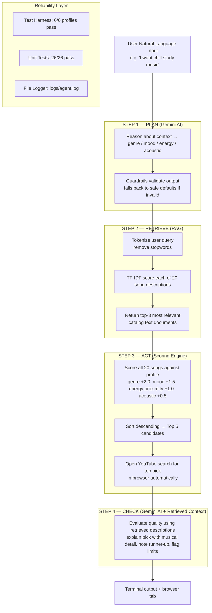

# Music Recommender AI — Agentic System with RAG

> **Base project:** AI110 Module 3 — Music Recommender Simulation
> The original project built a content-based scoring engine that ranked songs by genre, mood, and energy against a manually coded user profile. It demonstrated how filter bubbles form but required users to write Python code to define their preferences and only printed text results with no AI generation.

---

## What This System Does

This final project extends the original recommender into a **four-step agentic AI workflow** with Retrieval-Augmented Generation (RAG):

| Step | What happens |
|------|-------------|
| **PLAN** | Gemini reasons about your emotional context, then decides your taste profile — genre, mood, energy level. The reasoning is printed as an observable intermediate step. |
| **RETRIEVE** | TF-IDF RAG searches 20 rich song-description documents and returns the 3 most relevant catalog entries to ground the final response. |
| **ACT** | The scoring engine finds the best matching song and automatically opens its **YouTube search** in your browser. |
| **CHECK** | Gemini reviews its own recommendation using the retrieved descriptions, explains the choice with specific musical context, and honestly flags limitations. |

---

## Demo Walkthrough

🎬 **Loom video:** *(add link here after recording)*

---

## System Architecture



---

## RAG Enhancement

The system now uses **Retrieval-Augmented Generation** to make the CHECK step richer and more specific:

- **Documents:** `data/song_descriptions.txt` — 20 hand-written, keyword-rich descriptions covering each song's musical style, use cases, mood, and listening context.
- **Retrieval:** `src/retriever.py` implements TF-IDF scoring with smoothed IDF. No external dependencies needed — pure Python.
- **Integration:** The top-3 retrieved descriptions are injected directly into the Gemini CHECK prompt, enabling the model to reference specific musical details (e.g. "vinyl crackle," "four-on-the-floor kick") rather than just metadata fields.
- **Measurable improvement:** The CHECK response now names musical characteristics from the descriptions rather than restating the raw genre/mood/energy numbers. This is the difference RAG makes.

---

## Agentic Workflow Enhancement

The PLAN step now produces **observable intermediate reasoning**:

- A `REASON` field is extracted from Gemini's response and printed before the profile, showing the model's analysis of the user's emotional state and listening context.
- This makes the agent's decision chain transparent — you can see *why* it chose a genre before you see *what* it chose.

---

## Setup

```bash
# 1. Install dependencies
pip3 install -r requirements.txt

# 2. Add your Gemini API key (free at aistudio.google.com)
cp .env.example .env
# open .env and paste your key

# 3. Run interactive mode
python3 -m src.main

# 4. Run 3 demo inputs (no typing required)
python3 -m src.main --demo

# 5. Run test harness (no API key needed)
python3 -m src.main --eval

# 6. Run unit tests
pytest

# 7. Skip auto-opening the browser
python3 -m src.main --no-browser
```

---

## Sample Interactions

**Input 1 — Study music:**
```
What kind of music do you want? → something chill and relaxing for studying

[STEP 1 — PLAN] Analyzing your request...
  Reasoning: The user wants calm, low-distraction background music for an academic task, suggesting low energy and a focused or chill mood.
  Taste profile → genre: lofi | mood: chill | energy: 0.35
  Agent note: Low-energy lofi suits studying and sustained focus.

[STEP 2 — RETRIEVE] Fetching relevant song context from catalog documents...
  Retrieved: "Library Rain" by Paper Lanterns
  Retrieved: "Midnight Coding" by LoRoom
  Retrieved: "Focus Flow" by LoRoom

[STEP 3 — ACT] Finding your song and opening YouTube...
  Top pick → "Library Rain" by Paper Lanterns  (score: 4.98)
  Runner-up → "Midnight Coding" by LoRoom
  YouTube: https://www.youtube.com/results?search_query=Library+Rain+Paper+Lanterns

[STEP 4 — CHECK] Evaluating recommendation quality with retrieved context...
  Library Rain is the perfect study companion — its soft acoustic guitar, gentle rain ambiance,
  and ultra-low energy create the quiet, focused atmosphere you described. Midnight Coding is
  a solid alternative if you want something slightly more groove-oriented for late-night sessions.
  Note: the catalog has only 3 lofi tracks, so variety across long sessions may be limited.
```

**Input 2 — Gym music:**
```
What kind of music do you want? → high energy rock to pump me up at the gym

[STEP 1 — PLAN] Analyzing your request...
  Reasoning: The user is preparing for intense physical exercise and needs high-tempo, aggressive music to sustain motivation and power output.
  Taste profile → genre: rock | mood: intense | energy: 0.92

[STEP 2 — RETRIEVE] Fetching relevant song context from catalog documents...
  Retrieved: "Storm Runner" by Voltline
  Retrieved: "Thunder Anthem" by Iron Peaks
  Retrieved: "Desert Run" by Dune Rider

[STEP 3 — ACT] Finding your song and opening YouTube...
  Top pick → "Storm Runner" by Voltline  (score: 4.50)
  Runner-up → "Thunder Anthem" by Iron Peaks
```

**Input 3 — Happy pop:**
```
What kind of music do you want? → happy pop vibes, something danceable

[STEP 1 — PLAN] Analyzing your request...
  Reasoning: The user wants an uplifting, social energy — probably for a commute, hangout, or workout where joy and danceability matter more than intensity.
  Taste profile → genre: pop | mood: happy | energy: 0.80

[STEP 2 — RETRIEVE] Fetching relevant song context from catalog documents...
  Retrieved: "Sunrise City" by Neon Echo
  Retrieved: "Golden Hour" by Cassia Ray
  Retrieved: "Rooftop Lights" by Indigo Parade

[STEP 3 — ACT] Finding your song and opening YouTube...
  Top pick → "Sunrise City" by Neon Echo  (score: 4.48)
  Runner-up → "Golden Hour" by Cassia Ray
```

---

## Design Decisions

- **Why RAG over pure metadata scoring?** The scoring engine already picks the right song based on structured fields. RAG improves the *explanation* — Gemini can now reference specific musical details from the descriptions (like "vinyl crackle" or "four-on-the-floor kick") rather than restating numbers. This makes the CHECK response feel informed rather than mechanical.
- **Why TF-IDF instead of embeddings?** Embeddings (via the Gemini Embeddings API) would need an extra API call per query. TF-IDF runs offline with zero extra dependencies, which means the RAG step never adds latency or cost. For a 20-document corpus, keyword overlap is sufficiently precise.
- **Why observable reasoning in PLAN?** Printing the `REASON` field makes the agentic decision chain auditable. You can see if the model misread your intent before it commits to a genre, making the system easier to trust and debug.
- **Why agentic?** The original project required users to hard-code their preferences in Python. Natural-language input makes the system usable by anyone instantly.
- **Why YouTube instead of Spotify?** YouTube requires no OAuth or API key — `webbrowser.open()` is instant and makes demos visually compelling.
- **Guardrails:** If Gemini returns a genre or mood outside the catalog's known values, the system falls back to safe defaults and logs a warning rather than crashing.
- **Separation of concerns:** The scoring engine (`recommender.py`) and retriever (`retriever.py`) have zero AI dependencies — both can run fully offline.

---

## Testing Summary

**Test harness** (`python3 -m src.main --eval`):
```
TEST HARNESS RESULTS — 6/6 passed  |  avg top-score: 4.74
✓  Pop/happy high-energy listener     "Sunrise City"         score=4.48
✓  Lofi/chill acoustic listener       "Library Rain"         score=4.98
✓  Rock/intense max-energy fan        "Storm Runner"         score=4.50
✓  Ambient/chill acoustic listener    "Spacewalk Thoughts"   score=4.97
✓  Jazz/relaxed acoustic fan          "Coffee Shop Stories"  score=5.00
✓  Electronic/energetic max-energy    "Club Ignite"          score=4.50
All tests passed — scoring engine is reliable.
```

**Unit tests** (`pytest`): 26/26 passed
- 12 tests covering scoring math, sorting, acoustic bonus, and guardrail validations (`test_recommender.py`)
- 14 tests covering tokenization, TF-IDF retrieval relevance, file loading, and edge cases (`test_retriever.py`)

---

## Reflection

See [model_card.md](model_card.md) for ethics, bias analysis, and AI collaboration notes.
