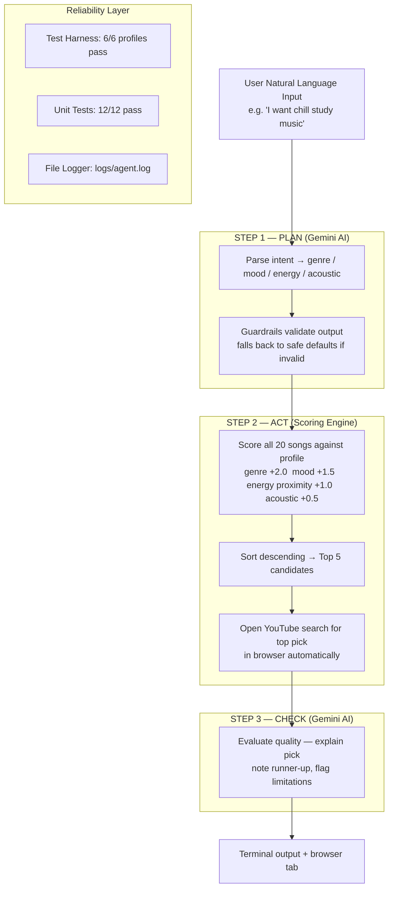

# Music Recommender AI — Agentic System

> **Base project:** AI110 Module 3 — Music Recommender Simulation
> The original project built a content-based scoring engine that ranked songs by genre, mood, and energy against a manually coded user profile. It demonstrated how filter bubbles form but required users to write Python code to define their preferences and only printed text results with no AI generation.

---

## What This System Does

This final project extends the original recommender into a **three-step agentic AI workflow**:

| Step | What happens |
|------|-------------|
| **PLAN** | Gemini reads your free-text request ("I want chill study music") and decides your taste profile — genre, mood, energy level. |
| **ACT** | The scoring engine retrieves the best matching song and automatically opens its **YouTube search** in your browser. |
| **CHECK** | Gemini reviews its own recommendation, explains why it chose that song, and honestly flags any limitations. |

---

## Demo Walkthrough

🎬 **Loom video:** *(add link here after recording)*

---

## System Architecture



---

## Setup

```bash
# 1. Install dependencies
pip3 install -r requirements.txt

# 2. Add your Gemini API key (free at aistudio.google.com)
cp .env.example .env
# open .env and paste your key

# 3. Run interactive mode
python3 -m src.main

# 4. Run 3 demo inputs (no typing required)
python3 -m src.main --demo

# 5. Run test harness (no API key needed)
python3 -m src.main --eval

# 6. Run unit tests
pytest

# 7. Skip auto-opening the browser
python3 -m src.main --no-browser
```

---

## Sample Interactions

**Input 1 — Study music:**
```
What kind of music do you want? → something chill and relaxing for studying

[STEP 1 — PLAN] Analyzing your request...
  Taste profile → genre: lofi | mood: chill | energy: 0.35
  Agent note: Low-energy lofi suits studying and focus.

[STEP 2 — ACT] Finding your song and opening YouTube...
  Top pick → "Library Rain" by Paper Lanterns  (score: 4.98)
  Runner-up → "Midnight Coding" by LoRoom
  YouTube: https://www.youtube.com/results?search_query=Library+Rain+Paper+Lanterns

[STEP 3 — CHECK] Evaluating recommendation quality...
  Library Rain is a perfect study companion with its ultra-low energy and chill mood.
  Midnight Coding is a solid alternative if you want something slightly livelier.
  Note: the catalog has only 3 lofi tracks so variety is limited.
```

**Input 2 — Gym music:**
```
What kind of music do you want? → high energy rock to pump me up at the gym

[STEP 1 — PLAN] Analyzing your request...
  Taste profile → genre: rock | mood: intense | energy: 0.92

[STEP 2 — ACT] Finding your song and opening YouTube...
  Top pick → "Storm Runner" by Voltline  (score: 4.50)
  Runner-up → "Thunder Anthem" by Iron Peaks
```

**Input 3 — Happy pop:**
```
What kind of music do you want? → happy pop vibes, something danceable

[STEP 1 — PLAN] Analyzing your request...
  Taste profile → genre: pop | mood: happy | energy: 0.80

[STEP 2 — ACT] Finding your song and opening YouTube...
  Top pick → "Sunrise City" by Neon Echo  (score: 4.48)
  Runner-up → "Golden Hour" by Cassia Ray
```

---

## Design Decisions

- **Why agentic?** The original project required users to hard-code their preferences in Python. Natural-language input makes the system usable by anyone instantly.
- **Why YouTube instead of Spotify?** YouTube requires no OAuth or API key — `webbrowser.open()` is instant and makes demos visually compelling.
- **Why Gemini?** Free tier, fast, and the structured-output parsing for PLAN step is reliable.
- **Guardrails:** If Gemini returns a genre or mood outside the catalog's known values, the system falls back to safe defaults and logs a warning rather than crashing.
- **Separation of concerns:** The scoring engine (`recommender.py`) has zero AI dependencies — it can be tested fully offline with `--eval`.

---

## Testing Summary

**Test harness** (`python3 -m src.main --eval`):
```
TEST HARNESS RESULTS — 6/6 passed  |  avg top-score: 4.74
✓  Pop/happy high-energy listener     "Sunrise City"         score=4.48
✓  Lofi/chill acoustic listener       "Library Rain"         score=4.98
✓  Rock/intense max-energy fan        "Storm Runner"         score=4.50
✓  Ambient/chill acoustic listener    "Spacewalk Thoughts"   score=4.97
✓  Jazz/relaxed acoustic fan          "Coffee Shop Stories"  score=5.00
✓  Electronic/energetic max-energy    "Club Ignite"          score=4.50
All tests passed — scoring engine is reliable.
```

**Unit tests** (`pytest`): 12/12 passed — covering scoring math, sorting, acoustic bonus, and all guardrail validations.

---

## Reflection

See [model_card.md](model_card.md) for ethics, bias analysis, and AI collaboration notes.
